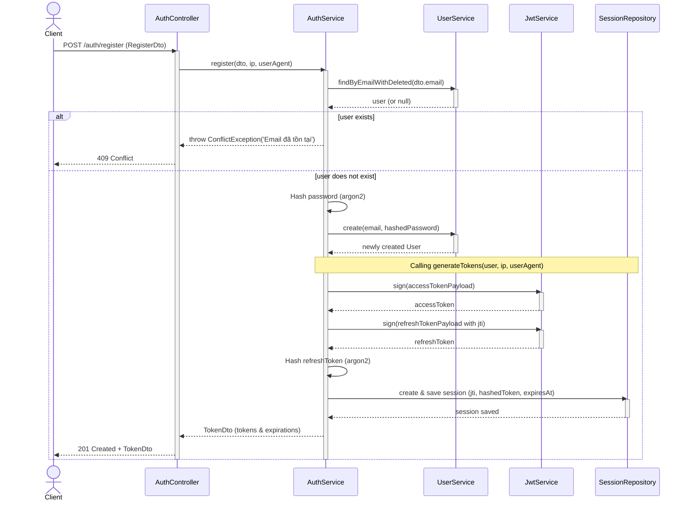
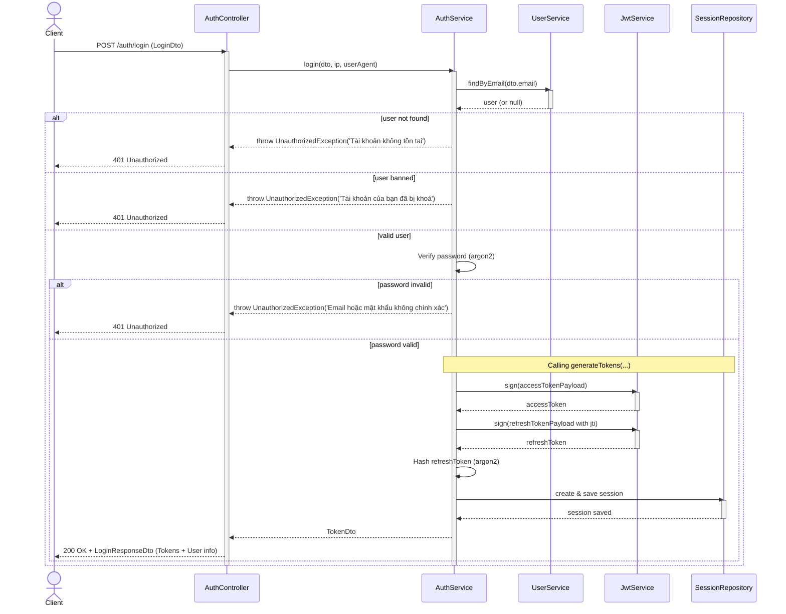
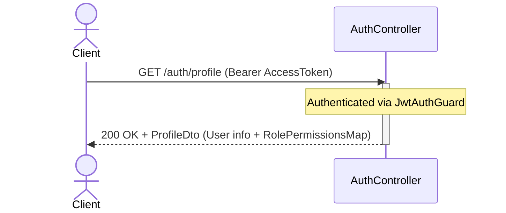
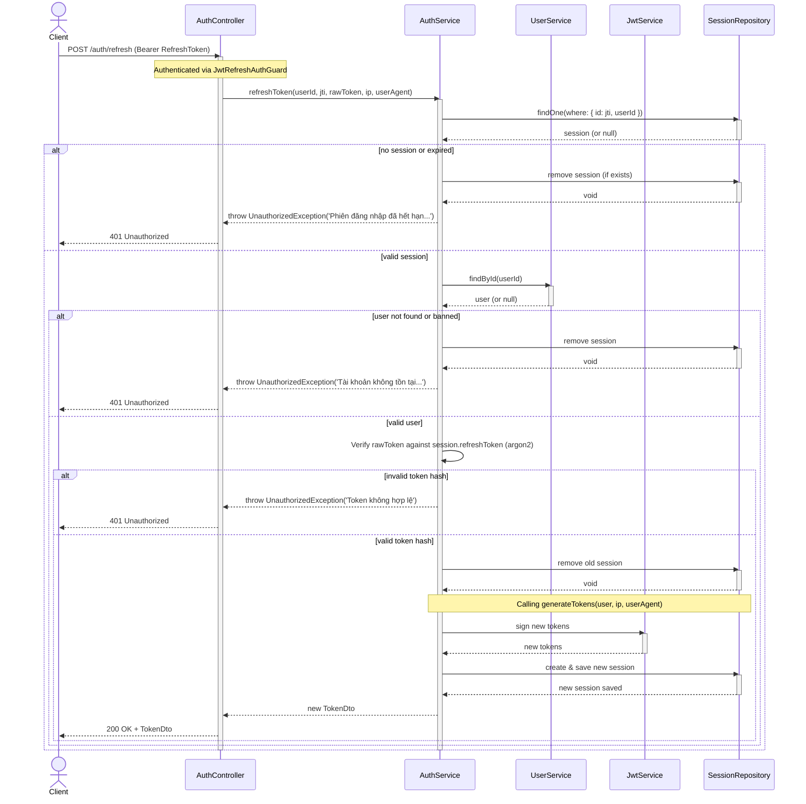
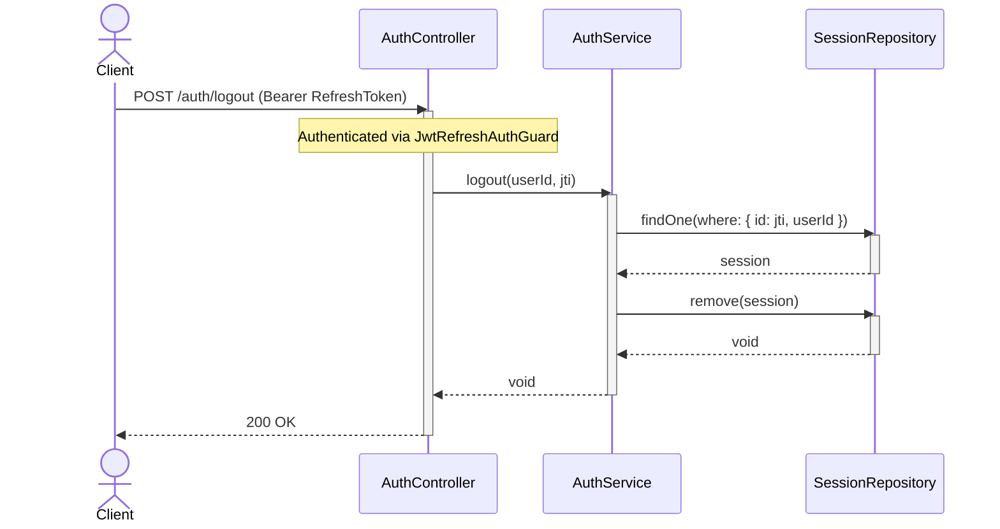

# Authentication Sequence Diagrams

This document contains the sequence diagrams for the endpoints provided by the `apps/api/src/auth` module.

## 1. Register (POST `/auth/register`)

## 2. Login (POST `/auth/login`)

## 3. Get Profile (GET `/auth/profile`)

## 4. Refresh Token (POST `/auth/refresh`)

## 5. Logout (POST `/auth/logout`)

