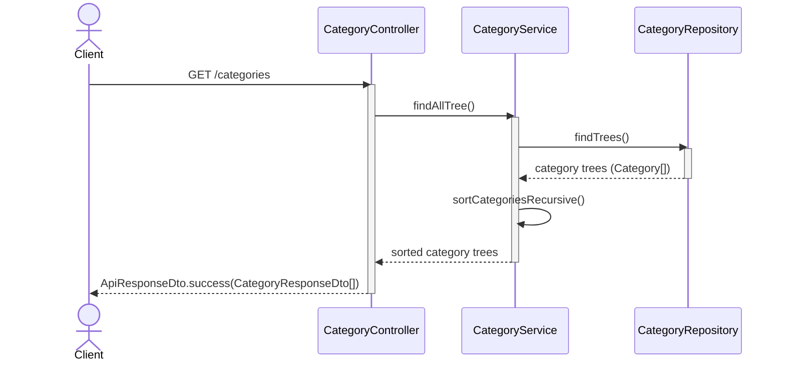
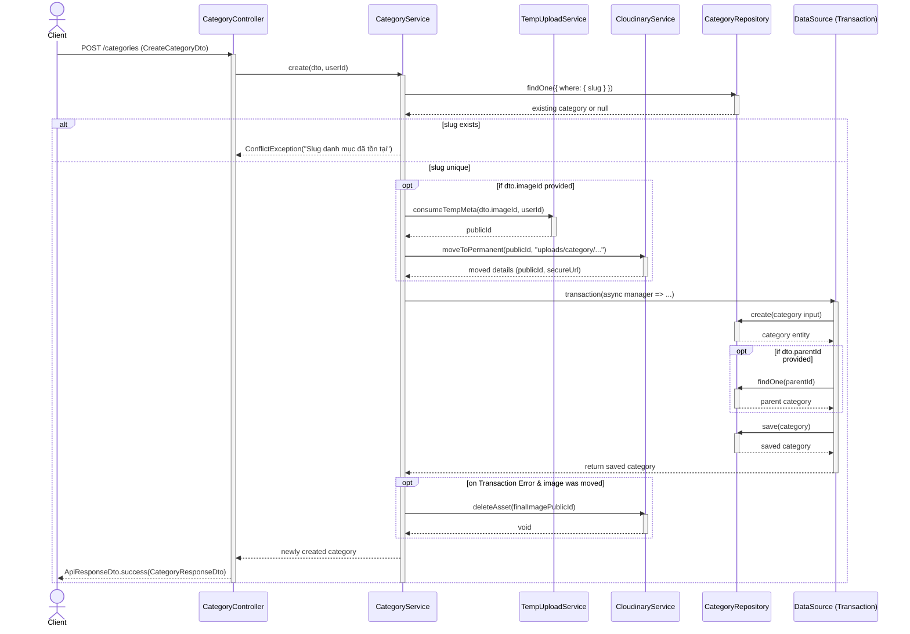
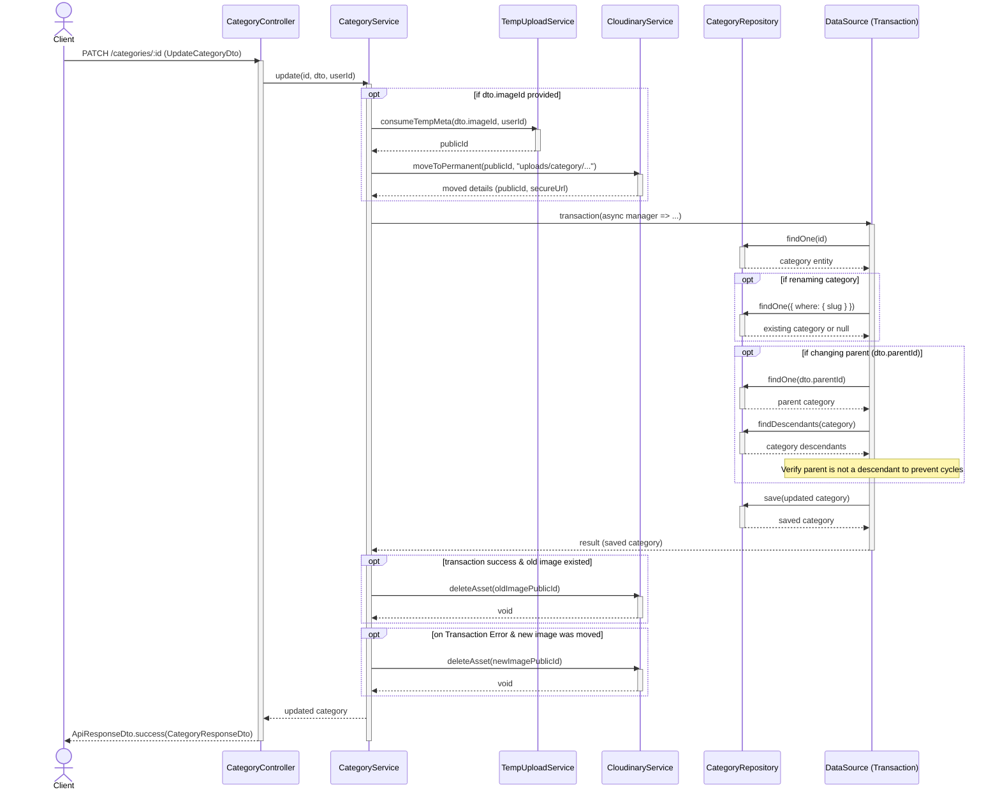
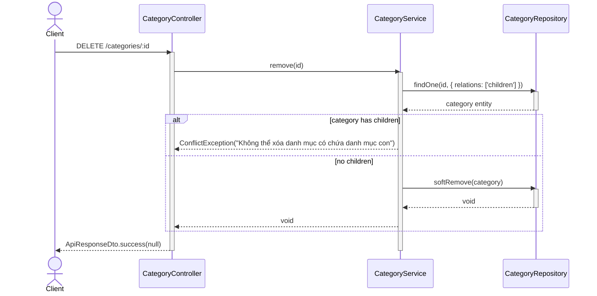

# Category Module Sequence Diagrams

This document contains sequence diagrams for the endpoints of the Category module (`apps/api/src/category`).

## 1. Retrieve Categories Tree Structure (GET `/categories`)

## 2. Create Category (POST `/categories`)

## 3. Update Category (PATCH `/categories/:id`)

## 4. Delete Category (DELETE `/categories/:id`)

